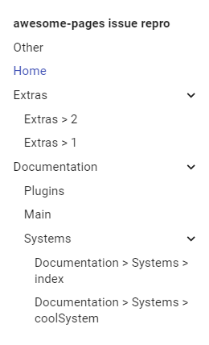

# `awesome-pages` issue repro

Reproduction repo for an issue I came across with [`awesome-pages`](https://github.com/lukasgeiter/mkdocs-awesome-pages-plugin) ([#86](https://github.com/lukasgeiter/mkdocs-awesome-pages-plugin/issues/86)).

<br/>



```yaml
nav:
    - Home: index.md
    - Documentation:
        - Main: documentation/main.md
        - Systems:
            - ... | flat | documentation/systems/*
        - Plugins: documentation/plugins.md
    - Other: other.md
    - ... | extras/*
```
